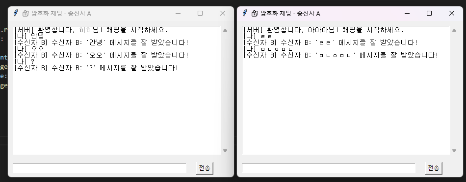

# 🔐 비대칭키 기반 암호화 채팅 프로그램

본 프로젝트는 Python 기반의 비대칭키(Public Key) 암호화를 이용한 채팅 프로그램입니다.  
송신자 A와 수신자 B가 서로 공개키를 교환하고, 메시지를 암호화하여 안전하게 송수신할 수 있도록 구현했습니다.

---

## 💡 프로젝트 개요

- **주제**: 비대칭키 기반 실시간 채팅 프로그램 구현
- **기술스택**: Python, socket, threading, tkinter, PyNaCl
- **특징**:
  - NaCl(`pynacl`) 라이브러리의 `Box`로 메시지를 암호화/복호화
  - 공개키 교환을 통한 안전한 통신
  - GUI 기반 채팅창
  - 멀티 클라이언트 지원 (서버 스레드 구조)

---

